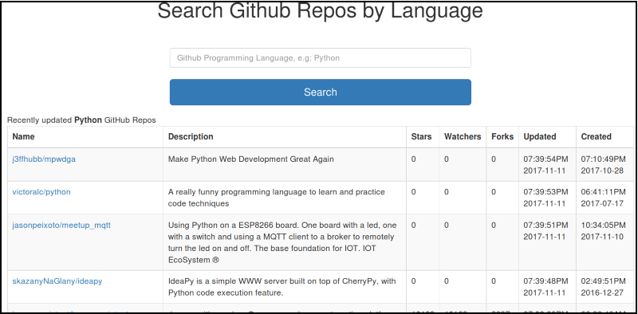

## Find recently updated repositories in GitHub by programming language

 Made using [Django 1.11](https://www.djangoproject.com/), [Bootstrap 3](https://getbootstrap.com/), [GitHub Search API 3](https://developer.github.com/v3/search/#search-repositories), [Webpack 3.8](https://webpack.js.org/), [Python 3.6](https://www.python.org/), and [LiClipse 4](https://www.liclipse.com/)
 
 Code is based on the tutorial [Django tutorial using GitHub API](https://drksephy.github.io/2015/07/16/django/)
 
 Instead of searching for developers, the code now searches for recently updated repositories in GitHub.  
 Also, the code was updated to work with Webpack instead of the deprecated Bower.  
 And of course the normal searching google, stackoverflow, and related offical documentations.
 
 Screenshot of application
 

 
 
## Clone this repo

`git clone https://github.com/mbrowniebytes/django_search_language.git`

## Webpack install packages

`npm install`  
Which installs: babel-core, babel-loader, style-loader, css-loader, webpack-bundle-tracker, jquery, bootstrap, etc 

## Django install packages

`pip3 install django`  
`pip3 install requests`  
`pip3 install python-dateutil`  
`pip3 install django-webpack-loader`  

## Serve the project and visit 127.0.0.1:8000

Run Webpack monitor  
`node server.js`  

Run Django webserver  
`python3 manage.py runserver`  
